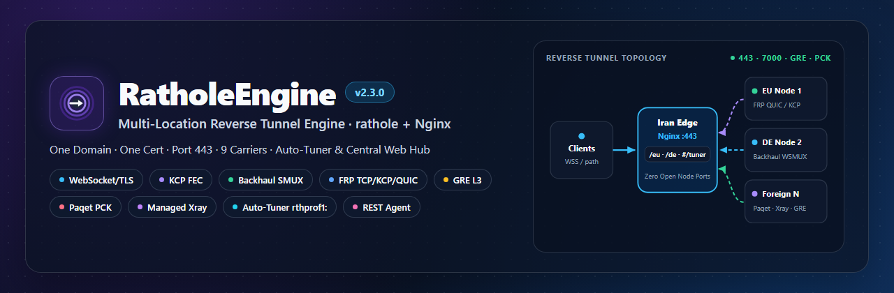
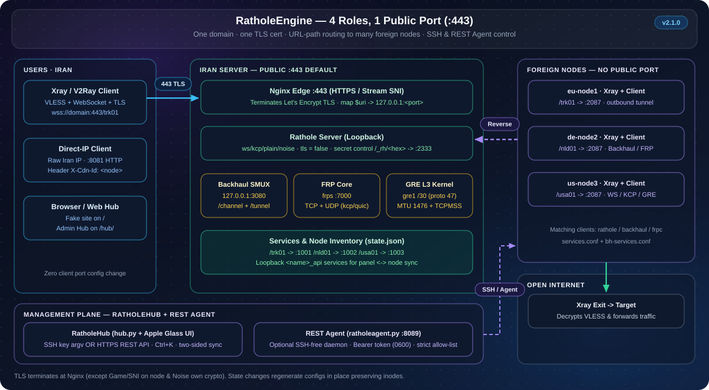
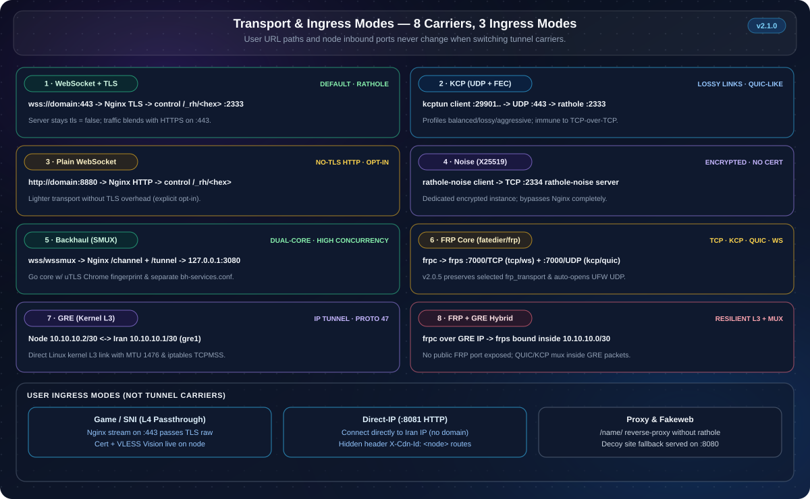
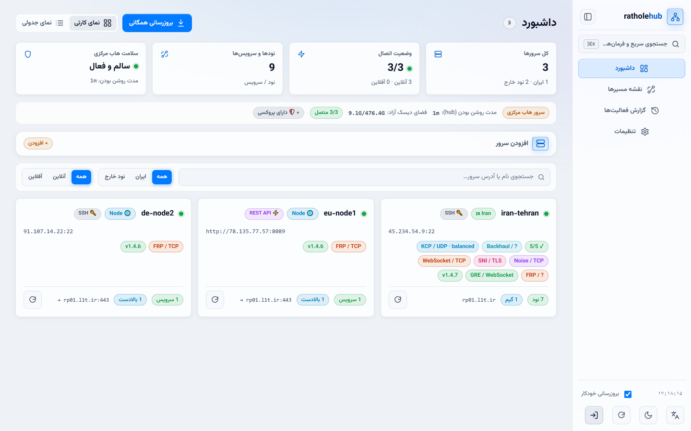
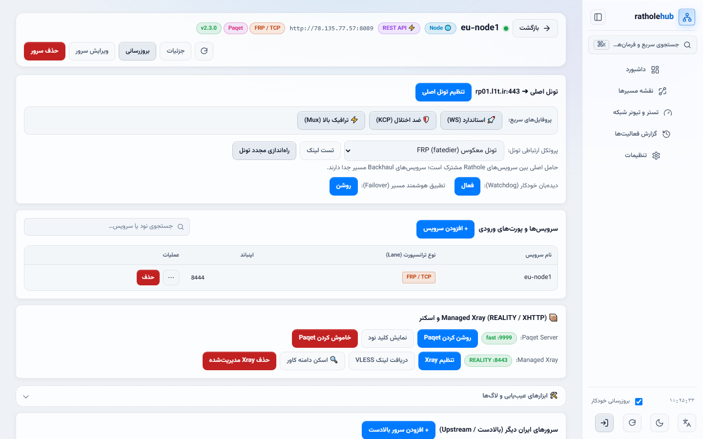
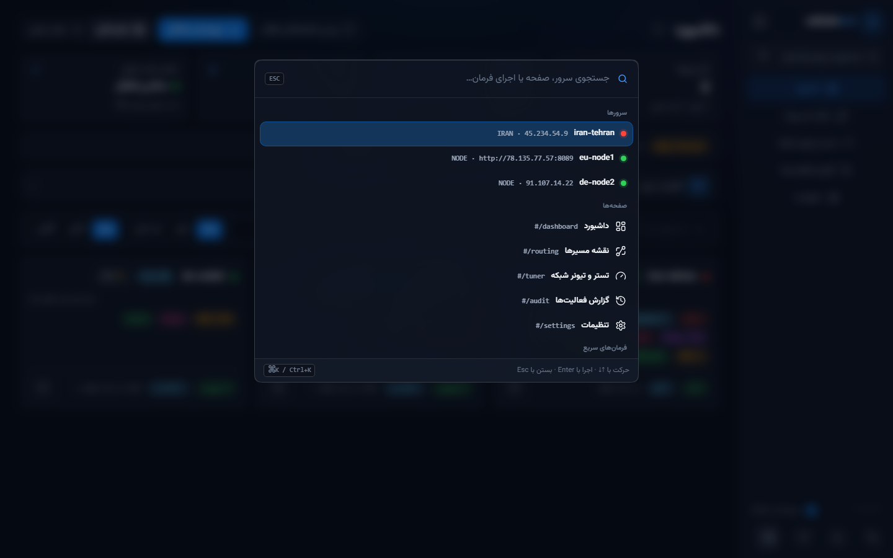

<div align="center">

<picture>
  <source media="(prefers-color-scheme: dark)" srcset="docs/assets/banner-dark.png">
  <source media="(prefers-color-scheme: light)" srcset="docs/assets/banner-light.png">
  
</picture>

**Multi-location reverse-tunnel engine built on `rathole` + `Nginx`** — _One port · one domain · 9 carriers · central Web Hub & Managed Xray_

[](https://github.com/l8PYGIT/RatholeEngine/actions/workflows/ci.yml)
[](https://l8pygit.github.io/RatholeEngine/)
[](https://github.com/l8PYGIT/RatholeEngine/releases/latest)
[](LICENSE)
[](https://github.com/l8PYGIT/RatholeEngine/stargazers)
[](https://t.me/l8PY4NET)

[**Docs Site**](https://l8pygit.github.io/RatholeEngine/) · [**Wiki**](https://l8pygit.github.io/RatholeEngine/wiki/Home/) · [**Quick Start**](#quick-start) · [**Transport Modes**](#transport--ingress-modes) · [**RatholeHub**](#ratholehub-web-panel-v210) · [**فارسی**](docs/README.fa.md) · [**Telegram**](https://t.me/l8PY4NET)

</div>

---

## Architecture

One **Iran edge server** behind a single domain, TLS certificate, and public `:443` port fronts many **foreign nodes** connected via outbound reverse tunnels (`map $uri $backend_port` in Nginx). The system spans **four roles**: Iran Panel ([`ratholectl`](rathole-manager/ratholectl)), Foreign Node ([`ratholenode`](rathole-manager/ratholenode)), Central Web Hub ([`hub.py`](rathole-manager/ratholehub/hub.py), stdlib Python), and an optional **REST Agent** ([`ratholeagent.py`](rathole-manager/ratholeagent.py), `:8089`). Every mutation edits state only, regenerates configs in place via `rth_commit_config` (preserving inodes for hot-reload), runs `nginx -t`, and reloads safely with automatic rollback.

<picture>
  <source media="(prefers-color-scheme: dark)" srcset="docs/assets/architecture.svg">
  <source media="(prefers-color-scheme: light)" srcset="docs/assets/architecture-light.svg">
  
</picture>

## Quick start

Run the one-command interactive installer (`Enter` picks latest release; choose role `1` Iran Panel, `2` Foreign Node, `3` Update, or `7` Uninstall):

```bash
curl -fsSL https://raw.githubusercontent.com/l8PYGIT/RatholeEngine/main/install.sh | sudo bash
```

> [!TIP]
> **Step-by-step interactive walkthrough:** [`docs/quickstart.md`](docs/quickstart.md) · [English](docs/quickstart.en.md)  
> **Offline / file-based install (`bootstrap.sh --local`):** [`docs/install-offline.md`](docs/install-offline.md) · [English](docs/install-offline.en.md)

<details>
<summary>⚙️ <b>Non-interactive flags, version pinning &amp; essential panel commands</b></summary>

```bash
# Iran panel (non-interactive)
curl -fsSL https://raw.githubusercontent.com/l8PYGIT/RatholeEngine/main/install.sh | sudo bash -s -- --panel \
  --domain panel.example.ir \
  --fullchain /root/cert/panel.example.ir/fullchain.pem \
  --key       /root/cert/panel.example.ir/privkey.pem

# Foreign node (keep node flags after `--`; pass `--release v2.1.1` before `--panel`/`--node` to pin)
curl -fsSL https://raw.githubusercontent.com/l8PYGIT/RatholeEngine/main/install.sh | sudo bash -s -- --node -- \
  --server panel.example.ir:443 --name trk01 --token <T> --inbound-port 2087

# Essential panel CLI
ratholectl hub on 8088            # enable Web Hub behind nginx /hub/
ratholectl add trk01 2087         # add node on /trk01 & print ready node install command
ratholectl status                 # panel dashboard (--json for Hub)
ratholectl doctor                 # end-to-end health check
```

</details>

## Transport & ingress modes

<picture>
  <source media="(prefers-color-scheme: dark)" srcset="docs/assets/transport-modes.svg">
  <source media="(prefers-color-scheme: light)" srcset="docs/assets/transport-modes-light.svg">
  
</picture>

| Carrier | Core / Layer | Default Port / Proto | Best Used For |
|---|---|---|---|
| **WebSocket + TLS** *(default)* | `rathole` (L7) | `:443/TCP` (`/_rh/<hex>` control) | Stealth HTTPS camouflage behind Nginx |
| **KCP** | `rathole` + `kcptun` | `:443/UDP` (FEC mux) | High packet-loss / congested paths |
| **Plain** | `rathole` (no TLS) | `:8880/TCP` | Minimal CPU overhead (explicit opt-in) |
| **Noise** | Second `rathole` | `:2334/TCP` (X25519) | Cert-free encrypted carrier off Nginx |
| **Backhaul (SMUX)** | `Musixal/Backhaul` | `:443/TCP` (`/channel`+`/tunnel` → `:3080`) | High-concurrency SMUX + uTLS Chrome |
| **FRP** | `fatedier/frp` | `:7000/TCP` (`tcp`/`ws`) + `:7000/UDP` (`kcp`/`quic`) | Flexible mux carrier off `:443` |
| **GRE** | Linux kernel `ip_gre` | IP Proto 47 (`/30` · `MTU 1476`) | Direct L3 IP link without proxy |
| **FRP + GRE** | FRP inside GRE `/30` | Kernel GRE + internal `:7000` | Strict DPI resistance combining L3 + mux |
| **Paqet (Direct PCK)** | `paqet` raw TCP+KCP | Random raw-TCP (`PCAP`/iptables) | Censorship evasion without any TLS handshake |

*Ingress & Edge modes:* **Managed Xray** (`VLESS+REALITY+Vision`, `VLESS+XHTTP` + concurrent **TLS 1.3 + ALPN `h2` Cover Scanner**), **Game / SNI** (L4 `:443` passthrough + PROXY protocol), **Direct-IP** (`:8081` + `X-Cdn-Id`), **Proxy** (`/<name>/` upstream), and **Fakeweb** (`:8080`). Full details: [`docs/transport-modes.en.md`](docs/transport-modes.en.md) · [فارسی](docs/transport-modes.md).

## RatholeHub web panel (`v2.2.0`)

- **Apple Glass UI (100% offline, stdlib Python)** — Light / Dark / System themes, bundled `vazirmatn.woff2`, Persian RTL / English LTR, native `<dialog>` modals, and **`⌘K / Ctrl+K` Command Palette**.
- **Security, Observability & Fleet Controls** — Scoped API keys (`read`/`operate`/`admin`), opt-in TOTP 2FA + recovery codes, CSRF Origin guard, SHA-256 hash-chained `audit.log` (`Verify chain`), `state.json` history & undo, Prometheus `/metrics`, Bidirectional Link Test, and Read-Only Fleet Drift detection.
- **Standalone Fleet Monitor, Telegram Relay & Signed Relayed Updates** — Independent `ratholemonitor.service` with hysteresis alerts and multi-path Telegram bot relay (`direct` / `proxy` / `node_tunnel`), adaptive fallback chain + EWMA backup endpoints, and Hub-relayed self-updates verified by Ed25519 `SHA256SUMS.sig`.
- **Fast KPI Dashboard, Paqet & Managed Xray UI** — 4 KPI cards, live filters, parallel status loading, inline carrier controls, Paqet client/server autofill + node Xray REALITY/XHTTP setup, VLESS URI generator, and TLS 1.3 cover scanner over SSH or REST Agent (`:8089`).

<div align="center">
<picture>
  <source media="(prefers-color-scheme: dark)" srcset="docs/assets/screenshots/dashboard-dark.png">
  <source media="(prefers-color-scheme: light)" srcset="docs/assets/screenshots/dashboard.png">
  
</picture>
</div>

<details>
<summary>📸 <b>More Hub screenshots (Iran Server, Foreign Node, Carrier Modal, Routing Map, Ctrl+K, Settings)</b></summary>

| Iran Server (`#/server/<iran>`) | Foreign Node (`#/server/<node>`) |
|---|---|
|  |  |

| Service Controls Modal | Routing Topology (`#/routing`) |
|---|---|
|  |  |

| Command Palette (`⌘K / Ctrl+K`) | Settings (`#/settings`) |
|---|---|
|  |  |

</details>

## Update, rollback & advanced options

```bash
curl -fsSL https://raw.githubusercontent.com/l8PYGIT/RatholeEngine/main/install.sh | sudo bash -s -- --update
# or from an installed host:  sudo ratholectl update  /  sudo ratholenode update
```

Every update takes a pre-change snapshot (`/var/backups/rathole-manager/`), runs health checks, and auto-rolls back on failure.

> [!WARNING]
> **Updating from v2.0.3 or older?** Run `sudo RATHOLE_GH=l8PYGIT/RatholeEngine ratholectl update` (or `ratholenode update`) once to migrate from the old repository slug.

<details>
<summary>🔐 <b>REST Agent setup, private repo updates, manual rollback &amp; uninstall</b></summary>

```bash
# Optional SSH-free REST Agent (:8089, Bearer auth, HTTPS supported)
sudo ratholectl agent on   # or: sudo install-agent.sh --role iran|node --port 8089

# Private GitHub repository install / update
curl -fsSL -H "Authorization: Bearer <PAT>" https://raw.githubusercontent.com/owner/repo/main/install.sh | sudo bash -s -- --token <PAT> --panel ...
sudo bash tools/update-private.sh

# Snapshots, manual rollback & uninstall
sudo bash rathole-manager/update.sh --list-backups
sudo bash rathole-manager/update.sh --rollback [<timestamp>]
sudo bash bootstrap.sh --uninstall   # add --purge --yes to remove binaries & hub config
```

</details>

## Documentation

| Doc | Contents |
|---|---|
| [**Docs Site & Wiki**](https://l8pygit.github.io/RatholeEngine/) | Complete Persian + English MkDocs Material site & Wiki ([Troubleshooting](https://l8pygit.github.io/RatholeEngine/wiki/Troubleshooting/)) |
| [`docs/quickstart.md`](docs/quickstart.md) · [`en`](docs/quickstart.en.md) | Interactive install walkthrough & troubleshooting |
| [`docs/architecture.md`](docs/architecture.md) · [`en`](docs/architecture.en.md) | 4 roles, management plane & `state→regenerate→reload` |
| [`docs/transport-modes.en.md`](docs/transport-modes.en.md) · [`fa`](docs/transport-modes.md) | All 9 carriers, `paqet`, Managed Xray (`REALITY`/`XHTTP`), FRP, GRE & ingress modes |
| [`docs/traffic-flow.md`](docs/traffic-flow.md) · [`en`](docs/traffic-flow.en.md) | Layer-by-layer packet flow & SVG reference |
| [`docs/hub.en.md`](docs/hub.en.md) · [`fa`](docs/hub.md) | RatholeHub UI, REST Agent, 2FA/RBAC, `/metrics`, Monitor Bot & security model |
| [`docs/performance.md`](docs/performance.md) · [`README.fa.md`](docs/README.fa.md) | BBR/KCP tuning & full Persian CLI reference |
| [`tools/telegram-bot-worker/`](tools/telegram-bot-worker/README.md) | Serverless Telegram announcer & Hub fleet monitor relay |
| [`CHANGELOG.md`](CHANGELOG.md) · [`CONTRIBUTING.md`](CONTRIBUTING.md) | Release notes (`v2.2.0`), tests, LF & code rules ([CoC](CODE_OF_CONDUCT.md)) |

## Community & Donate

📢 **[Telegram Channel — @l8PY4NET](https://t.me/l8PY4NET)** (releases & fastest support) · 🐙 **[GitHub Issues](https://github.com/l8PYGIT/RatholeEngine/issues)** (attach `ratholectl doctor`)

<a id="donate"></a>
| USDT (BEP-20 / BSC) | TON | TRX (Tron) |
|---|---|---|
| `0x2364898407e8A42DA554B909989cd9B28eE61314` | `UQCondoXRwQNt0fQvvmYGa_Fn39D9szjQH4eBqIcUd5r1yfH` | `TRhnkJFpj9uxA2aqUxapJAFhkzNPbfxKwp` |

---

## خلاصه‌ی فارسی

**RatholeEngine (`v2.2.0`)** یک سیستم تونل معکوس چند-موقعیتی روی **rathole + Nginx** است: یک سرور ایران (پشت یک دامنه، یک گواهی TLS و پورت `443`) جلوی چندین نود خارج قرار می‌گیرد و ترافیک بر اساس **path** هدایت می‌شود. شامل ۴ نقش است: پنل ایران (`ratholectl`)، نود خارج (`ratholenode`)، پنل وب **RatholeHub** (رابط شیشه‌ای Apple Glass، توکن‌های باسطح دسترسی، تایید دومرحله‌ای 2FA/TOTP، گزارش ممیزی زنجیره‌ای SHA-256، `/metrics` پرومتئوس، مانیتور مستقل و ربات تلگرام، رلهٔ آپدیت با امضای Ed25519) و **REST Agent** اختیاری (`:8089` بدون SSH). از ۹ حامل (**WebSocket/TLS**، **KCP+FEC**، **Plain**، **Noise**، **Backhaul SMUX**، **FRP**، **GRE لایه ۳**، **FRP+GRE** و **Paqet Direct PCK**) به‌علاوه‌ی **Managed Xray** (`REALITY+Vision` / `XHTTP` + اسکنر سایت کاور TLS 1.3) پشتیبانی می‌کند. شروع سریع و مستندات کامل فارسی: [`docs/quickstart.md`](docs/quickstart.md) · [`docs/README.fa.md`](docs/README.fa.md) · [**@l8PY4NET**](https://t.me/l8PY4NET).
